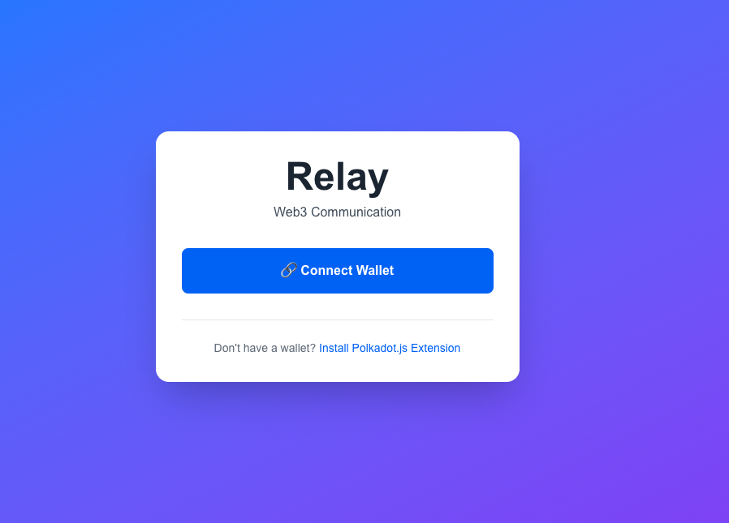

<style>
body {
  font-size: 1.15rem; /* Slightly larger normal text for readability */
  line-height: 1.75;
}
</style>

# Relay - Polkadot Web3 Communication Platform

**Polkadot-first, Ethereum-friendly**

PolkaVM
https://blockscout-passet-hub.parity-testnet.parity.io/

The chat & identity system is built on Polkadot's tech stack, but can recognize and onboard users from the Ethereum world using the EVM compatibility layer.
Decentralized Identity & Live Communication for Polkadot Users

A user-centric app where Polkadot users register a unique on-chain username, discover others, and instantly connect via decentralized video chat — without sharing personal data or relying on centralized servers.



---

## Overview

**Relay** is a decentralized Web3 communication platform built on the Polkadot ecosystem. It enables secure, wallet-based messaging, video calls, and group rooms without requiring traditional authentication systems. Your wallet is your identity.

---

## Live Demo

🚀 **[relay.techangelx.com](https://relay.techangelx.com)**

---

## How It Works

Relay uses a **dual-wallet architecture** for different purposes:

### Polkadot.js Extension (Primary Authentication)

* **Purpose:** Login and chat identity
* **What it does:** Connects your Substrate-based wallet to authenticate and identify you in the app
* **Address format:** Substrate address (e.g., `5GrwvaEF5zXb26Fz9rcQpDWS57CtERHpNehXCPcNoHGKutQY`)
* **Used for:**

  * Logging into Relay
  * Your chat identity
  * Contact management
  * Receiving messages

### MetaMask (Optional - Username Registration)

* **Purpose:** On-chain username registration on Passet Hub
* **What it does:** Connects to the EVM-compatible Passet Hub testnet to register usernames
* **Address format:** Ethereum-style address (e.g., `0x742d35Cc6634C0532925a3b844Bc9e7595f0bEb`)
* **Used for:**

  * Registering on-chain usernames (optional)
  * Paying 0.001 PAS registration fee
  * Interacting with UsernameRegistry smart contract

---

### Authentication Flow

```
User Opens App ↓
Connect Polkadot.js → Get Substrate Address → Login to Chat ↓
User in Chat App (using Polkadot address) ↓
Optional: Register Username ↓
Connect MetaMask → Switch to Passet Hub → Pay 0.001 PAS → Username Saved ↓
Back to Chat (username now displays instead of address)
```

> **Note:** You can use Relay without ever connecting MetaMask. Username registration is completely optional — the app works perfectly fine using just your wallet address.

---

## Features

<div style="display: grid; grid-template-columns: repeat(auto-fit, minmax(300px, 1fr)); gap: 1.5rem;">

### 🪪 Wallet-Based Authentication

* Connect with Polkadot.js extension
* No passwords, no email signup
* Your keys, your identity

### 💬 Real-Time Messaging

* Instant peer-to-peer messaging
* Socket.io for real-time communication
* Contact management system
* Message history

### 👥 Group Rooms

* Create and join video chat rooms
* Token-gated access *(coming soon)*
* Persistent room links

### 🎥 Video & Voice Calls

* WebRTC-powered video calling
* PeerJS for P2P connections
* Low-latency communication

### 🔗 On-Chain Usernames

* Register usernames on Passet Hub (Paseo testnet)
* Smart contract-based identity
* 0.001 PAS registration fee
* Optional feature — works without registration

### 🎨 Modern UI

* Beautiful Tailwind CSS design
* Responsive and mobile-friendly
* Smooth animations and transitions
* Dark mode support

</div>

---

## Tech Stack

**Frontend:**

* Next.js 15.5.6 with Turbopack
* React 19 + TypeScript
* PAPI (Polkadot API SDK)
* Tailwind CSS 4.1
* Deployed on Vercel

**Backend:**

* Node.js + Express
* Socket.IO for real-time messaging
* TypeScript
* Deployed on Fly.io

**Web3:**

* Polkadot.js API (Substrate wallet connection)
* Ethers.js (EVM interaction)
* Solidity Smart Contracts
* Hardhat (Smart contract development)

**Communication:**

* Socket.io (WebSocket for real-time messaging)
* PeerJS (WebRTC for video/voice)
* IPFS (planned for file sharing)

**Infrastructure:**

* Frontend: Vercel
* Backend: Fly.io
* Custom domain: [relay.techangelx.com](https://relay.techangelx.com)

---

## Installation

### Prerequisites

* Node.js 20+
* npm or yarn
* **Polkadot.js browser extension** (required)
* **MetaMask** (optional - only needed for username registration)

### Local Development Setup

```bash
# Clone the repository
git clone https://github.com/TechAngelX/relay.git
cd relay

# Install frontend dependencies
npm install

# Install backend dependencies
cd server
npm install
cd ..

# Start backend server (Terminal 1)
cd server
npm run dev

# Start frontend dev server (Terminal 2)
npm run dev
```

The app will be available at:
**Frontend:** [http://localhost:3001](http://localhost:3001)
**Backend:** [http://localhost:3000](http://localhost:3000)

---

### Environment Setup

**Frontend Environment Variables**


**Backend Environment Variables**

```bash
PORT=3000
```

Fly.io sets this automatically in production.

---

## Deployment

### Frontend (Vercel)

1. Push to GitHub
2. Import project in Vercel
3. Add environment variable: `NEXT_PUBLIC_SOCKET_URL`
4. Deploy automatically on push

### Backend (Fly.io)

```bash
cd server
fly launch  # First time only
fly deploy  # Subsequent deployments
```

---

## Usage

### 1. Connect Wallet (Required)

* Install Polkadot.js extension
* Click **"Connect Wallet"**
* Approve the connection
* You’re now logged in with your Substrate address

### 2. Set Username (Optional)

* Choose a unique username (3–20 characters)
* Install MetaMask if not already installed
* Connect MetaMask when prompted
* Approve network switch to Passet Hub
* Pay 0.001 PAS to register on-chain
* Or skip and use your wallet address as display name

### 3. Add Contacts

* Click **"+ Add Contact"**
* Enter contact's Substrate wallet address and name
* Start chatting in real-time

### 4. Create Rooms

* Click **"Create Room"**
* Name your room
* Share the room link with others for group video calls

---

## Smart Contracts

### Username Registry (EVM on Passet Hub)

* **Contract Address:** `0x0E4716Dc8b9c6a6DC32867b50042d71C181B87C2`
* **Network:** Passet Hub Testnet (Paseo)
* **Chain ID:** `0x190f1b46` (420420422 decimal)
* **RPC:** [https://testnet-passet-hub-eth-rpc.polkadot.io](https://testnet-passet-hub-eth-rpc.polkadot.io)
* **Explorer:** [https://blockscout-passet-hub.parity-testnet.parity.io](https://blockscout-passet-hub.parity-testnet.parity.io)

**Contract Functions:**

* `registerUsername(string username)` — Register a new username (0.001 PAS)
* `updateUsername(string newUsername)` — Update existing username (0.005 PAS)
* `getUsername(address user)` — Get username for an address
* `getAddress(string username)` — Get address for a username

---

## Project Structure

```
relay/
├── src/
│   ├── app/
│   │   ├── components/      # React components
│   │   ├── services/        # Business logic
│   │   └── page.tsx         # Main page
│   └── ...
├── server/
│   ├── src/
│   │   └── server.ts        # Express + Socket.io server
│   ├── package.json
│   └── tsconfig.json
├── public/                  # Static assets
├── contracts/               # Smart contracts
├── next.config.ts
└── package.json
```

---

## Roadmap

* [x] Polkadot.js wallet authentication
* [x] Real-time messaging via Socket.io
* [x] On-chain username registry (EVM)
* [x] Video calling infrastructure (PeerJS)
* [x] Dual wallet support (Substrate + EVM)
* [x] Production deployment (Vercel + Fly.io)
* [ ] End-to-end encryption
* [ ] IPFS file sharing
* [ ] Token-gated rooms
* [ ] NFT-based profiles
* [ ] Mobile app (React Native)
* [ ] Group video calls (multiple participants)
* [ ] Cross-chain messaging

---

## Known Issues

**PolkaVM Storage Bug:**
The Passet Hub testnet currently has a bug preventing storage reads (`sload` operation) from smart contracts. Username registration (writes) works correctly, but retrieval (reads) is temporarily disabled.

**Workaround:**
Usernames are stored locally in browser `localStorage` as a fallback until the bug is fixed.

---

## Contributing

Contributions are welcome! Please feel free to submit a Pull Request.

```bash
# Fork the repository
git checkout -b feature/AmazingFeature
git commit -m "Add some AmazingFeature"
git push origin feature/AmazingFeature
```

Open a Pull Request.

---

## License

This project is licensed under the **MIT License**.

---

## Author

*Ricki Angel*
GitHub: [@TechAngelX](https://github.com/TechAngelX)
Website: [relay.techangelx.com](https://relay.techangelx.com)

---

## Acknowledgments

* Polkadot ecosystem and Parity Technologies
* Passet Hub testnet infrastructure
* Socket.io team for real-time communication
* PeerJS maintainers for WebRTC implementation
* Vercel and Fly.io for deployment infrastructure

---

## Support

For issues and questions:

* Open an issue on GitHub
* Visit [relay.techangelx.com](https://relay.techangelx.com)

**Built on Polkadot | Powered by Web3**
