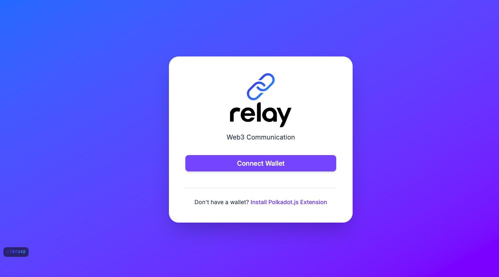
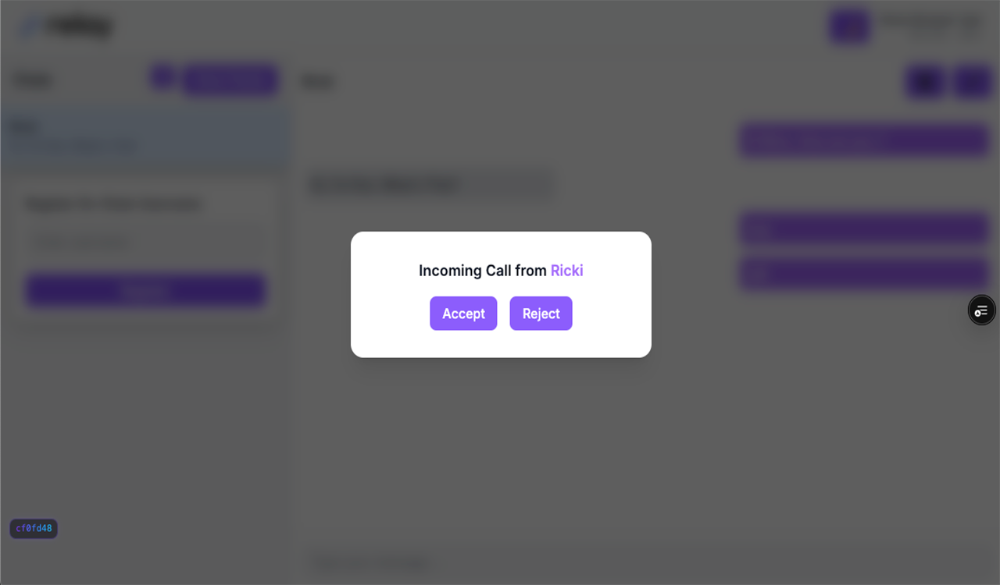
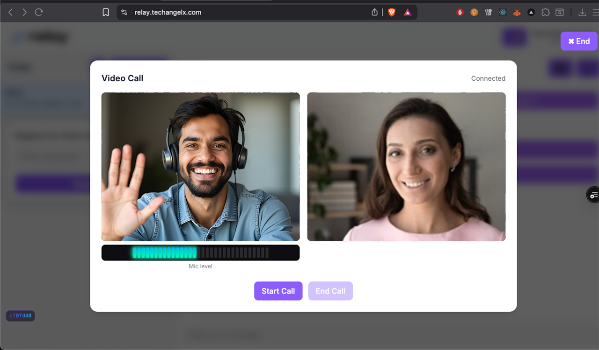
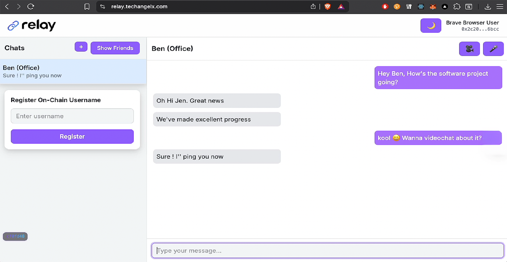
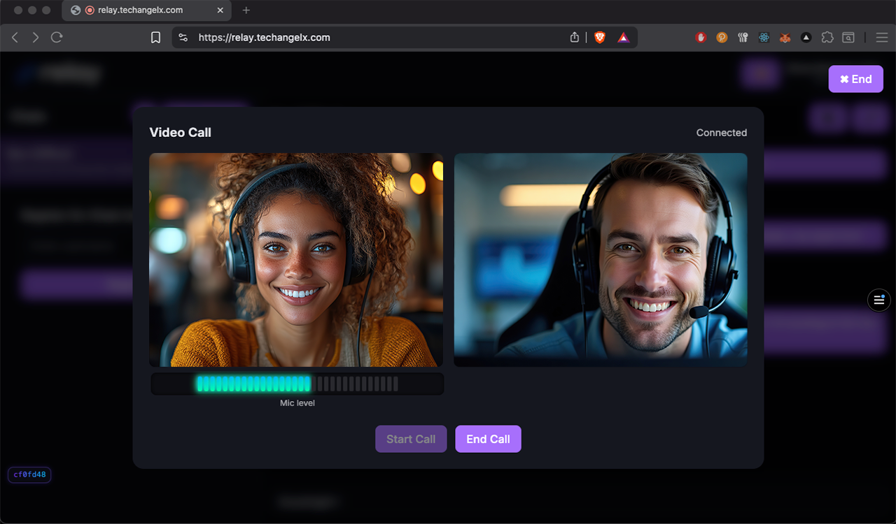
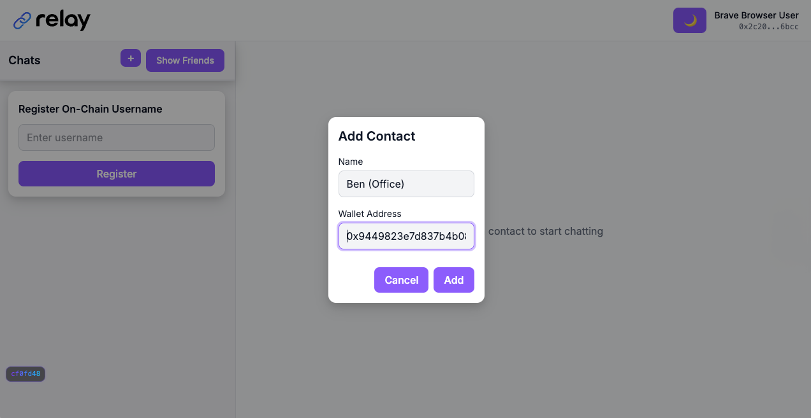
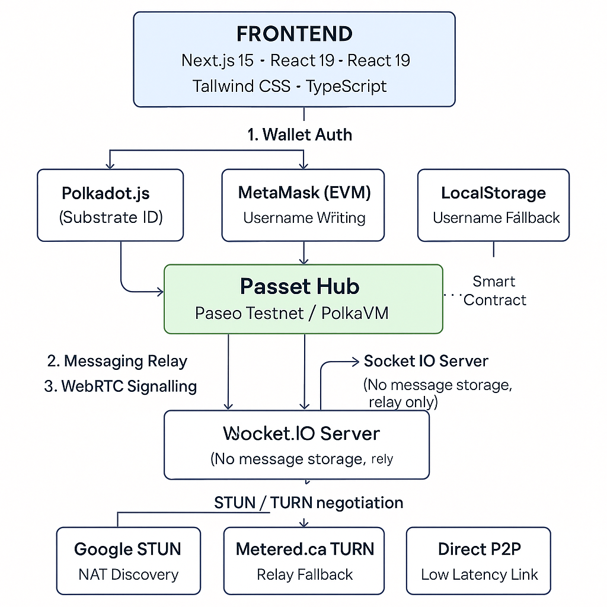

# Relay - Polkadot Web3 Communication Platform

**Polkadot-first, Ethereum-friendly**

A decentralised communication platform where Polkadot users register unique on-chain usernames, discover others, and instantly connect via peer-to-peer messaging and video chat; super fast and low latency — without sharing personal data or relying on centralised servers.

Built on Polkadot's tech stack with EVM compatibility layer support for Ethereum users.

Currently running on PolkaVM technology ⭕️: the Passet Hub Testnet (Asset Hub on Paseo) with PolkaVM EVM compatibility layer, allowing deployment of Solidity smart contracts on Polkadot infrastructure.
The project was initially submitted to the Build Resilient Apps with Polkadot Cloud Hackathon.






---

## Live Demo

**🚀 Live Demo
Try it now: [relay.techangelx.com](https://relay.techangelx.com)**

---

## Overview

**Relay** is a decentralised Web3 communication platform built on the Polkadot ecosystem. It enables secure, wallet-based messaging, video calls, and group rooms without requiring traditional authentication systems. Your wallet is your identity.

---

## Features

### Wallet-Based Authentication
* Connect with Polkadot.js extension
* No passwords, no email signup
* Your keys, your identity

### Real-Time Messaging
* Instant peer-to-peer messaging
* Socket.io for real-time communication
* Cool Responsive Dark-Mode
* Contact management system
* Message history

### Group Rooms
* Create and join video chat rooms
* Token-gated access *(coming soon)*
* Multi-room video chat  *(coming soon)*
* Persistent room links

### Video & Voice Calls
* WebRTC-powered peer-to-peer video calling
* STUN/TURN servers for NAT traversal
* Low-latency direct connections
* Audio level metering

### On-Chain Usernames
* Register usernames on Passet Hub (Paseo testnet)
* Smart contract-based identity
* 0.001 PAS registration fee
* Optional feature — works without registration

### Modern UI
* Beautiful Tailwind CSS design
* Responsive and mobile-friendly
* Smooth animations and transitions
* Dark mode support

## How It Works

Relay uses a **dual-wallet architecture** for different purposes:

### Polkadot.js Extension (Primary Authentication)

* *Substrate Wallet ImplementationL:** Connects your Substrate-based wallet to authenticate and identify you in the app
* **Address format:** Substrate address (e.g., `5GrwvaEF5zXb26Fz9rcQpDWS57CtERHpNehXCPcNoHGKutQY`)

### MetaMask (Optional - Username Registration)

* **On-chain username registration on Passet Hub**
* **Connects to the EVM-compatible Passet Hub testnet to register usernames**
* **Ethereum-style address (e.g., `0x742d35Cc6634C0532925a3b844Bc9e7595f0bEb`)**
* **Used forRegistering on-chain usernames (optional)**
* **Paying 0.001 PAS registration fee for nteracting with UsernameRegistry smart contract**


## Tech Stack

**Frontend:**
* Next.js 15.5.6 with Turbopack
* React 19 + TypeScript
* PAPI (Polkadot API SDK)
* Tailwind CSS 4.1
* Deployed on Vercel

**Backend:**
* Node.js + Express
* Socket.IO for real-time messaging
* TypeScript
* Deployed on Fly.io

**Web3:**
* Polkadot.js API (Substrate wallet connection)
* Ethers.js (EVM interaction)
* Solidity Smart Contracts
* Hardhat (Smart contract development)

**Communication:**
* Socket.io (WebSocket for real-time messaging)
* WebRTC (peer-to-peer video/voice)
* STUN servers (Google STUN for NAT traversal)
* TURN servers (Metered.ca relay for difficult networks)
* IPFS (planned for file sharing)

**Infrastructure:**
* Frontend: Vercel
* Backend: Fly.io
* Custom domain: [relay.techangelx.com](https://relay.techangelx.com)


## Architectural Overview


## Installation

### Prerequisites

* Node.js 20+
* npm or yarn
* **Polkadot.js browser extension** (required)
* **MetaMask** (optional - only needed for username registration)

### Local Development Setup (HTTPS Required)

**Important:** WebRTC requires HTTPS for camera and microphone access. Local development must use HTTPS.
```bash
# Clone the repository
git clone https://github.com/TechAngelX/relay.git
cd relay

# Install frontend dependencies
npm install

# Install backend dependencies
cd server
npm install
cd ..

# Start backend server (Terminal 1)
cd server
npm run dev

# Start frontend dev server with HTTPS (Terminal 2)
npm run dev-https
```

The app will be available at:
* **Frontend:** `https://localhost:3001`
* **Backend:** `https://localhost:3000`

### Environment Setup

**Frontend Environment Variables**

Create `.env.local`:
```bash
NEXT_PUBLIC_SOCKET_URL=wss://localhost:3000
```

For production:
```bash
NEXT_PUBLIC_SOCKET_URL=wss://relay-server.fly.dev
```

**Backend Environment Variables**
```bash
PORT=3000
USE_HTTPS_SERVER=true
```

---

## Docker Setup (Local NAT/HTTPS)

For local network testing with HTTPS (required for camera/microphone access), you can run Relay in Docker.

### 1. Generate SSL Certificates

Create a local SSL certificate using [mkcert](https://github.com/FiloSottile/mkcert):
```bash
# Install mkcert (macOS)
brew install mkcert
brew install nss  # Firefox support

# Install local CA
mkcert -install

# Create ssl directory (if it doesn't exist)
mkdir -p ssl

# Generate certificate for your local IP
# Replace 192.168.0.10 with your actual local IP address
mkcert -key-file ssl/localhost+3-key.pem -cert-file ssl/localhost+3.pem localhost 192.168.0.10 127.0.0.1

# Verify certificates were created
ls -la ssl/
```

**Find your local IP:**
```bash
# macOS
ipconfig getifaddr en0

# Linux
hostname -I | awk '{print $1}'
```

### 2. Build Docker Image
```bash
docker build -t relay-full .
```

### 3. Run Docker Container

Replace `192.168.0.10` with your actual local IP address:
```bash
docker run -p 3000:3000 -p 3001:3001 \
  -v "$(pwd)/ssl:/app/ssl:ro" \
  -e USE_HTTPS_SERVER=true \
  -e NEXT_PUBLIC_SOCKET_URL=wss://192.168.0.10:3000 \
  relay-full
```

### 4. Access the Application

Open your browser and navigate to:
```
https://192.168.0.10:3001
```

**Important:** You must use `https://` for WebRTC to function properly.

### 5. Enable Camera and Microphone Access

**Important:** Browsers require HTTPS for camera/microphone access in WebRTC applications.

**Chrome/Brave:**
1. Navigate to `chrome://settings/content/camera`
2. Add `https://192.168.0.10:3001` to allowed sites
3. Navigate to `chrome://settings/content/microphone`
4. Add `https://192.168.0.10:3001` to allowed sites

**Firefox:**
1. Navigate to `about:preferences#privacy`
2. Scroll to "Permissions" section
3. Click "Settings" next to Camera
4. Allow `https://192.168.0.10:3001`
5. Repeat for Microphone

**macOS System Permissions:**
1. Open System Settings → Privacy & Security
2. Select Camera
3. Enable access for your browser
4. Select Microphone
5. Enable access for your browser

**Safari:**
1. Go to Safari → Settings → Websites
2. Select Camera and Microphone
3. Set permissions for the site

### Dockerfile
```dockerfile
# Base image
FROM node:20-alpine

# Set working directory
WORKDIR /app

# Copy dependency manifests
COPY package*.json ./
COPY server/package*.json ./server/

# Install dependencies
RUN npm install

# Install git for commit hashes
RUN apk add --no-cache git

# Install backend dependencies
WORKDIR /app/server
RUN npm install

# Return to root
WORKDIR /app

# Copy entire project
COPY . .

# Build frontend and backend
RUN npm run build || echo "frontend build skipped"
WORKDIR /app/server
RUN npm run build || echo "backend build skipped"

# Install concurrently globally
WORKDIR /app
RUN npm install -g concurrently

# Override socket URL for local backend
ENV NEXT_PUBLIC_SOCKET_URL=wss://localhost:3000

# Expose ports
EXPOSE 3000 3001

# Start both frontend and backend
CMD ["concurrently", "node server/dist/server.js", "npm run dev-https"]
```

---

## Deployment

### Frontend (Vercel)

1. Push to GitHub
2. Import project in Vercel
3. Add environment variable: `NEXT_PUBLIC_SOCKET_URL=wss://relay-server.fly.dev`
4. Deploy automatically on push

### Backend (Fly.io)
```bash
cd server
fly launch  # First time only
fly deploy  # Subsequent deployments
```

---

## Usage

### 1. Connect Wallet (Required)

* Install Polkadot.js extension
* Click **"Connect Wallet"**
* Approve the connection
* You're now logged in with your Substrate address

### 2. Set Username (Optional)

* Choose a unique username (3–20 characters)
* Install MetaMask if not already installed
* Connect MetaMask when prompted
* Approve network switch to Passet Hub
* Pay 0.001 PAS to register on-chain
* Or skip and use your wallet address as display name

### 3. Add Contacts

* Click **"+ Add Contact"**
* Enter contact's Substrate wallet address and name
* Start chatting in real-time

### 4. Create Rooms

* Click **"Create Room"**
* Name your room
* Share the room link with others for group video calls

---

## Smart Contracts

### Username Registry (EVM on Passet Hub)

* **Contract Address:** `0x0E4716Dc8b9c6a6DC32867b50042d71C181B87C2`
* **Network:** Passet Hub Testnet (Paseo)
* **Chain ID:** `0x190f1b46` (420420422 decimal)
* **RPC:** `https://testnet-passet-hub-eth-rpc.polkadot.io`
* **Explorer:** `https://blockscout-passet-hub.parity-testnet.parity.io`

**Contract Functions:**

* `registerUsername(string username)` — Register a new username (0.001 PAS)
* `updateUsername(string newUsername)` — Update existing username (0.005 PAS)
* `getUsername(address user)` — Get username for an address
* `getAddress(string username)` — Get address for a username

---
## Project Structure
```
relay/
├── src/
│   ├── app/              # Next.js application
│   ├── abis/             # Smart contract ABIs
│   ├── data/             # Local data storage
│   └── types/            # TypeScript type definitions
├── server/
│   ├── src/              # Express + Socket.io backend
│   ├── dist/             # Compiled backend
│   └── fly.toml          # Fly.io configuration
├── ssl/                  # SSL certificates (local dev)
├── public/               # Static assets
├── contracts/            # Smart contracts
├── Dockerfile            # Docker configuration
├── next.config.ts        # Next.js configuration
└── package.json          # Dependencies
```

---

## Roadmap

### Completed
* [x] Polkadot.js wallet authentication
* [x] Real-time messaging via Socket.io
* [x] On-chain username registry (PolkaVM/EVM)
* [x] WebRTC peer-to-peer video calling
* [x] PeerJS integration
* [x] STUN/TURN server configuration
* [x] Dual wallet support (Substrate + EVM)
* [x] Production deployment (Vercel + Fly.io)

### Planned
* [ ] End-to-end encryption for messages
* [ ] IPFS picture and file sharing
* [ ] Multi-participant video chat rooms
* [ ] Token-gated rooms
* [ ] NFT-based profiles
* [ ] Mobile app (React Native)
* [ ] Cross-chain messaging

---

## Known Issues

**PolkaVM Storage Bug:**
The Passet Hub testnet currently has a bug preventing storage reads (`sload` operation) from smart contracts. Username registration (writes) works correctly, but retrieval (reads) is temporarily disabled.

**Workaround:**
Usernames are stored locally in browser `localStorage` as a fallback until the bug is fixed.

---

## Contributing

Contributions are welcome! Please feel free to submit a Pull Request.
```bash
# Fork the repository
git checkout -b feature/AmazingFeature
git commit -m "Add some AmazingFeature"
git push origin feature/AmazingFeature
```

Open a Pull Request.

---

## Licence

This project is licensed under the **MIT Licence**.

---

## Author

*Ricki Angel*

GitHub: [@TechAngelX](https://github.com/TechAngelX)

Website: [relay.techangelx.com](https://relay.techangelx.com)

---

## Acknowledgements

* Polkadot ecosystem and Parity Technologies
* Passet Hub testnet infrastructure
* Socket.io team for real-time communication
* WebRTC community for peer-to-peer protocols
* PeerJS maintainers
* Vercel and Fly.io for deployment infrastructure

---

## Support

For issues and questions:

* Open an issue on GitHub
* Visit [relay.techangelx.com](https://relay.techangelx.com)

**Built on Polkadot | Powered by Web3**
